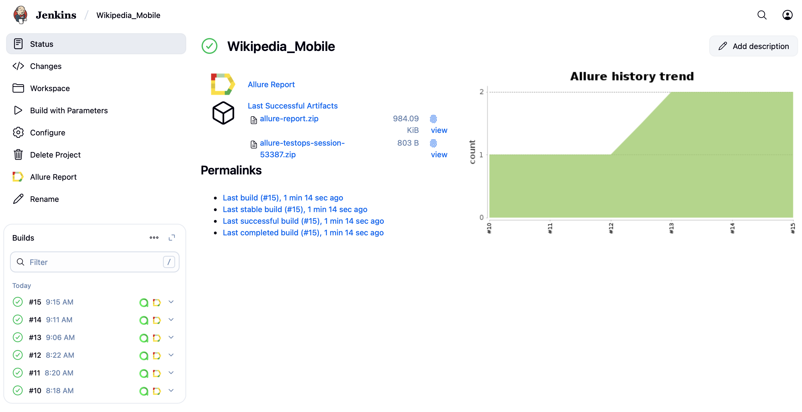
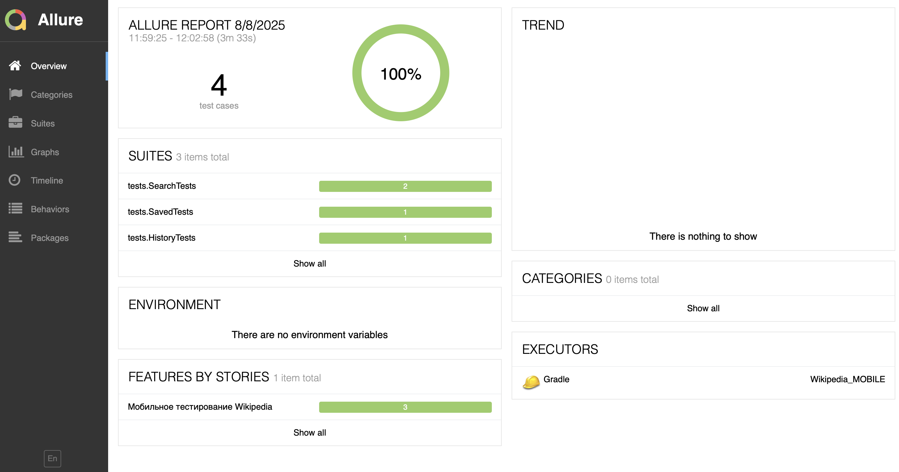
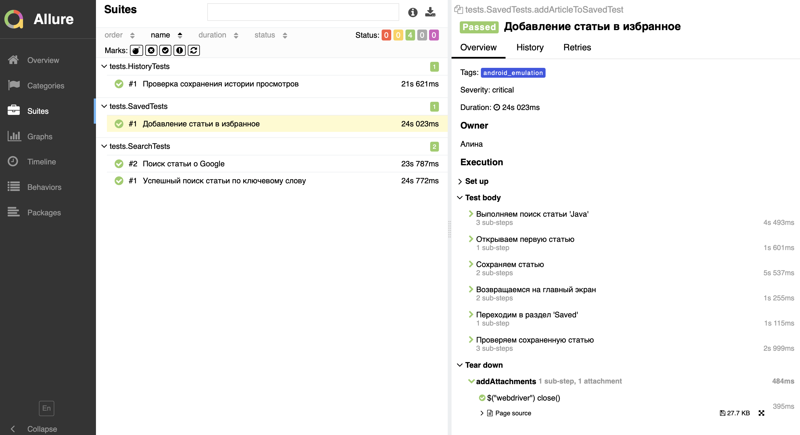
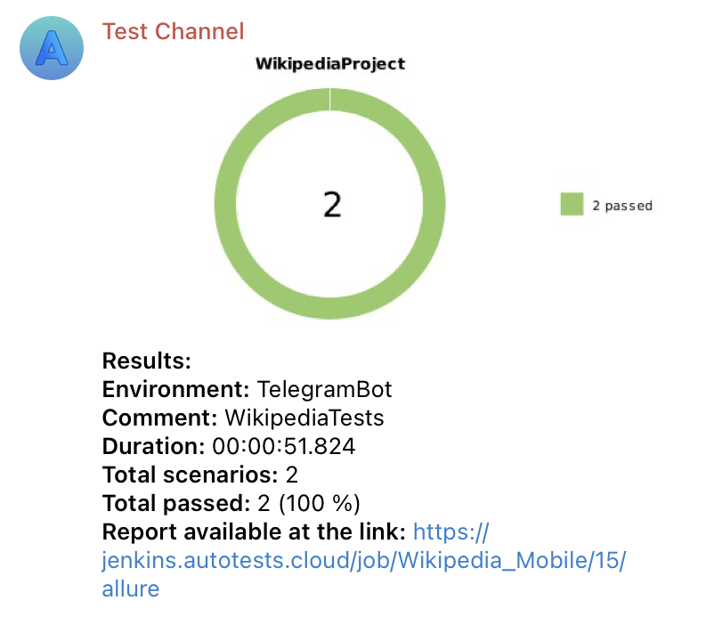
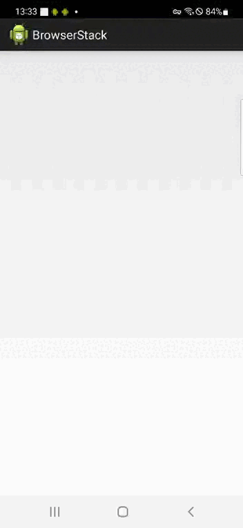

# Проект по автоматизации тестовых сценариев для мобильного приложения Wikipedia <a href="https://www.wikipedia.org"> 

## 📔 Содержание:
- Технологии и инструменты
- Описание автоматизированных тестов 
- Сборка в Jenkins
- Запуск автотестов
- Allure отчет
- Allure TestOps
- Уведомления в Telegram
- Видео выполнения тестов на Selenoid

## 🛠 Технологии и инструменты: 

| Java |IntelliJ<br>Idea| GitHub | JUnit <br> 5 | Gradle | Selenide | Selenoid | Alurre <br> Report | Jenkins |
|------|----------------|--------|--------------|--------|----------|----------|--------------------|---------|
|[](https://www.java.com) | [](https://www.jetbrains.com/idea/) | [](https://github.com) | [](https://junit.org/junit5/) | [](https://gradle.org) | [](https://selenide.org) | [](https://aerokube.com/selenoid/) | [](https://docs.qameta.io/allure/) | [](https://www.jenkins.io) | 
| TestOps |Brawserstack| Appium |Android <br> Studio| Android |REST <br> Assured|Appium <br> Inspector| Telegram |
| [](https://qameta.io) | [](https://www.browserstack.com) | [](https://appium.io/docs/en/latest/) | [](https://developer.android.com/studio?hl=ru) | [](https://www.android.com) | [](https://reqres.in) | [](https://appium.github.io/appium-inspector/2024.12/quickstart/) | [](https://telegram.org) |

## ☑️ Описание автоматизированных тестов
- Все тесты помечены тегами
- Шаговый подход через step()
- Четкое разделение тестов по функционалу
### Структура тестов
Тесты разделены на 3 класса по функциональным блокам:
- SearchTests - тестирование поиска статей
- SavedTests - работа с избранными статьями
- HistoryTests - проверка истории просмотров
### Описание реализованных проверок
#### SearchTests - Функционал поиска
- Успешный поиск статьи по ключевому слову
#### SavedTests - Работа с избранным
- Добавление статьи в избранное
#### HistoryTests - История просмотров
- Проверка сохранения истории

##  Сборка в [Jenkins](https://jenkins.autotests.cloud/job/BooksShop/)
<p align="center">

</p> 

### Параметры сборки в Jenkins:
- deviceHost (local, browserstack)

## ▶️ Запуск автотестов

### Запуск тестов из терминала
```bash
gradle clean test
```
#### Локально на эмуляторе:
```bash
gradle clean android_emulation
```
#### На BrowserStack:
```bash
gradle clean android_browserstack
```
#### Для работы тестов необходимо:
- Для локальных тестов - запущенный Appium сервер и эмулятор
- Для BrowserStack - корректные учетные данные в browserstack.properties

### Запуск тестов на удаленном браузере

```bash
clean test
-DdeviceHost=${deviceHost}
```

##  [Allure Report](https://jenkins.autotests.cloud/job/BooksShop/allure/)
### Overview
<p align="center">  

</p>  

### Тест-кейсы
<p align="center">  

</p>  

##  [Allure TestOps](https://allure.autotests.cloud/project/4846/test-cases?treeId=0)
<p align="center">  

</p>  

### Ручные и и автоматизированные тест кейсы
<p align="center">  

</p> 

##  Уведомления в Telegram с использованием бота
<p align="center">  

</p>  

##  Примеры видео выполнения тестов на Selenoid
<p align="center">  

</p>
